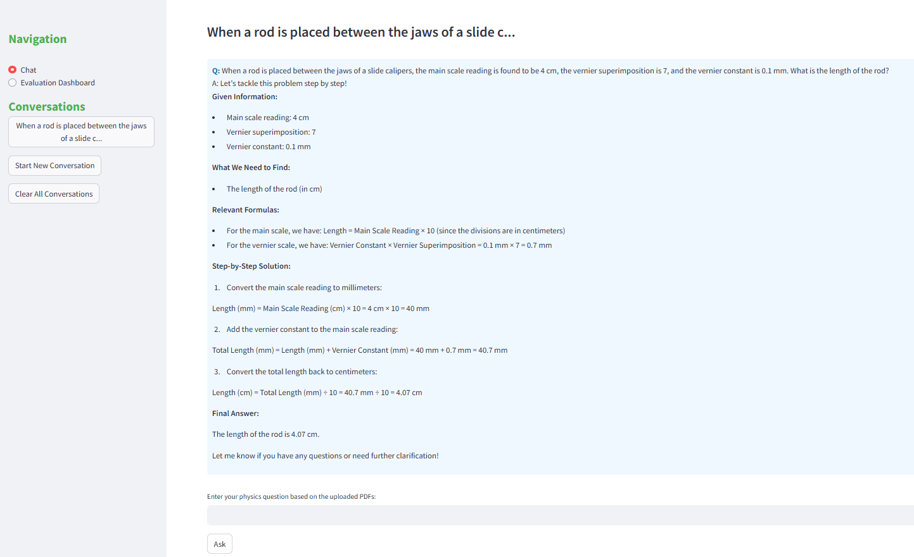
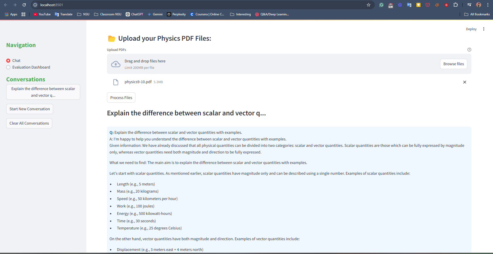
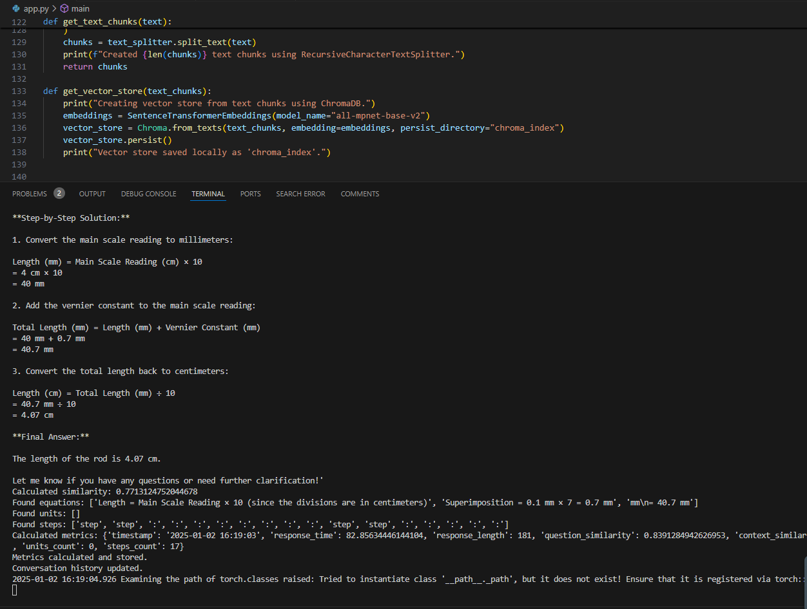

# physics-local-chatbot
A local physics chatbot that leverages Retrieval-Augmented Generation (RAG) technology. Upload your physics textbooks and ask questions - the system works completely offline. It processes PDFs to create a knowledge base and provides detailed physics explanations, making learning accessible without internet dependency.

## Features

- **Local Execution**: Fully functional offline, ensuring privacy 
- **RAG Architecture**: Combines the power of retrieval systems and generative language models for accurate and relevant answers.
- **Multi-session Support**: Enables smooth conversations over multiple interactions.
- **Open Source Models**: Uses the **Llama3:latest** model from Ollama for efficient and lightweight performance.
- **Factual and Conversational**: Capable of answering questions and holding conversations effectively.(it may hallucinate when hold conversation )
- **GPU Acceleration**: Utilizes GPU for faster processing when available
- **Performance Metrics**: Monitor response quality, timing, and physics-specific metrics
## Example 

## Screenshot

Another

in VS code

## Weaknesses

- **Slow Response Time**: The chatbot may take a significant amount of time to generate responses.

- **Potential for Hallucinations**: While holding conversations, the model may occasionally generate inaccurate or fabricated information.

# Technology Stack

This project uses the following technologies:  

- **Python 3.8+**: Core programming language.  
- **Streamlit**: Web interface.  
- **LangChain**: RAG implementation.  
- **SentenceTransformers**: Text embeddings.  
- **ChromaDB**: Vector database.  
- **PyPDF2**: PDF processing.  
- **Plotly**: Metrics visualization.  
- **PyTorch**: GPU acceleration.  
- **TensorFlow**: Model optimization.  
